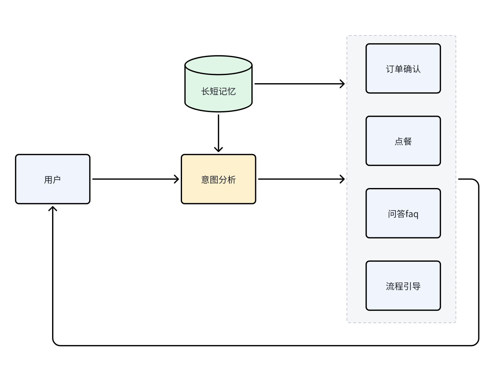

# Ordering-Agent

Ordering-Agent 是一个基于大语言模型（LLM）的餐厅小i机器人，能够帮助用户进行点餐、查询餐厅信息、确认订单等操作。系统支持多轮对话，并根据用户的需求提供个性化的引导。

## 架构图

以下是系统的整体架构图：



## 功能概览

- **餐厅信息查询**：用户可以查询餐厅的基本信息和菜单。
- **点餐服务**：帮助用户选择菜品并确认订单。
- **订单确认**：核对用户的订单并提供总价。
- **多轮对话**：支持上下文关联的对话，提供更好的用户体验。
- **灵活引导**：在用户需求不明确时，引导用户完成点餐。

## 主要目录介绍

### `config.py`
- 存储项目的全局配置，包括配置LLM_KEY相关信息等。

### `data/`
- **prompts.yaml**: 集中管理所有的prompt模板，避免重复输入，方便统一管理和更新。

### `utils.py`
- 通用工具类函数的实现，包括日志记录(`set_logger`)和LLM API交互(`call_llm_api`)功能。

### `agent/`
- **`agents.py`**: 整合后的Agent脚本，包含意图识别、流程引导、FAQ处理、订餐和订单确认等功能。
- **`actions.py`**: 定义所有与LLM交互的辅助函数，负责加载`prompts.yaml`并与LLM API进行通信。

### `run_server.py`
- 项目的主脚本，用于启动对话服务。处理用户输入、调用相应的Agent函数，并管理对话历史。

## 安装与使用

### 1. 克隆项目

```bash
git clone https://github.com/yourusername/Ordering-Agent.git
cd Ordering-Agent
```

### 2. 配置文件
`config.py`: 你可以在`config.py`中配置LLM_KEY相关信息等。

### 3. 运行服务
使用以下命令启动对话服务：

```bash
python run_server.py
```
